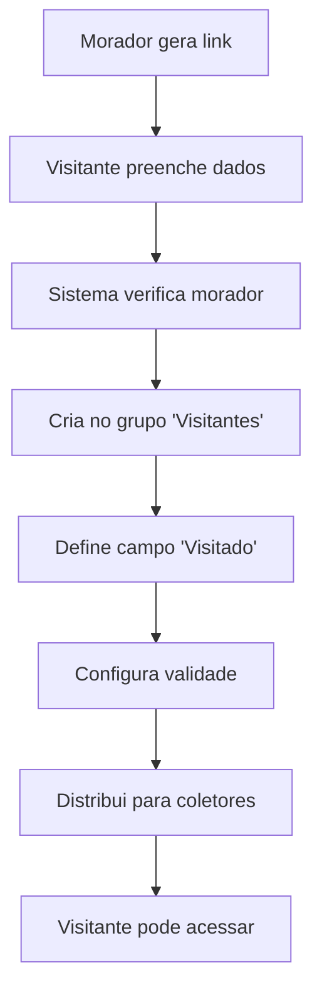

# 📋 Sistema de Cargos/Grupos HikCentral

## 🎯 Como Funciona o Sistema de Cargos

### **1. ESTRUTURA HIERÁRQUICA**

```
HikCentral
├── 👥 GRUPOS (Cargos)
│   ├── 🏠 Moradores
│   │   ├── Apto 101 - João Silva
│   │   ├── Apto 102 - Maria Santos
│   │   └── ...
│   │
│   ├── 👤 Visitantes
│   │   ├── Visitante João (Visitando: Maria Santos)
│   │   ├── Visitante Ana (Visitando: João Silva)
│   │   └── ...
│   │
│   ├── 🔧 Funcionários
│   │   ├── Porteiro - José
│   │   ├── Zelador - Carlos
│   │   └── ...
│   │
│   └── 🚛 Prestadores
│       ├── Entregador - Pedro
│       ├── Técnico - Lucas
│       └── ...
```

### **2. CONFIGURAÇÃO NO HIKCENTRAL**

#### **🏠 Grupo "Moradores"**
- **Acesso:** Permanente (24/7)
- **Coletores:** Todos os acessos do condomínio
- **Permissões:** Completas
- **Campo "Visitado":** Não usado (eles não visitam, moram)

#### **👤 Grupo "Visitantes"** (NOSSO FOCO)
- **Acesso:** Temporário (1-3 dias)
- **Coletores:** Apenas acessos de visitantes
- **Campo "Visitado":** Nome do morador que está recebendo
- **Permissões:** Limitadas aos horários e locais específicos

### **3. COMO NOSSO SISTEMA INTEGRA**

```typescript
// No nosso webSDKService.ts
const hikCentralData = {
  nomePropio: 'João da Silva',        // Nome do visitante
  apellido: '',                       // Sobrenome (opcional)
  visitado: 'Maria Santos',           // MORADOR QUE ESTÁ RECEBENDO
  moradorUnidade: 'Apto 102',         // Unidade do morador
  objetivoVisita: 'Visita Social',    // Motivo da visita
  horaSaida: '2025/08/18 23:59:59',   // Quando expira
  grupoVisitantes: 'Visitantes',      // GRUPO/CARGO no HikCentral
  coletoresEntrada: ['Entrada Visitante 2', 'Entrada Catraca Prestador'],
  coletoresSaida: ['Saída Catraca Prestador', 'Saída Caminhão Baixo']
};
```

### **4. COMO VER CARGOS VIA WebSDK**

#### **📋 Comando para Listar Grupos:**
```javascript
// Via WebSDK - Listar todos os grupos/cargos
const grupos = await WebSDK.getCargos({
  ip: '192.168.1.205',
  usuario: 'luca',
  senha: 'Luca123#'
});

// Resultado esperado:
[
  { id: 1, nome: 'Moradores', tipo: 'permanente' },
  { id: 2, nome: 'Visitantes', tipo: 'temporario' },
  { id: 3, nome: 'Funcionários', tipo: 'permanente' },
  { id: 4, nome: 'Prestadores', tipo: 'temporario' }
]
```

#### **👤 Comando para Criar Usuário em Grupo:**
```javascript
const novoVisitante = await WebSDK.criarUsuario({
  nome: 'João da Silva',
  grupo: 'Visitantes',        // CARGO/GRUPO
  visitado: 'Maria Santos',   // MORADOR
  validade: '2025-08-18',
  coletores: ['192.168.1.205', '192.168.1.210']
});
```

### **5. FLUXO COMPLETO**



### **6. VERIFICAÇÕES IMPORTANTES**

#### **✅ Para Confirmar se Funcionou:**
1. **No HikCentral:** Pessoas → Grupo "Visitantes"
2. **Verificar:** Campo "Visitado" = nome do morador
3. **Verificar:** Validade configurada
4. **Testar:** Acesso nos coletores especificados

#### **🔍 Via WebSDK (Consulta):**
```javascript
// Listar visitantes ativos
const visitantesAtivos = await WebSDK.listarUsuarios({
  grupo: 'Visitantes',
  status: 'ativo'
});

// Verificar acesso específico
const acessoPermitido = await WebSDK.verificarAcesso({
  usuario: 'João da Silva',
  coletor: '192.168.1.205'
});
```

### **7. CONFIGURAÇÃO NECESSÁRIA NO HIKCENTRAL**

Para que nossa integração funcione, o HikCentral deve ter:

1. **✅ Grupo "Visitantes" criado**
2. **✅ Campo "Visitado" habilitado**
3. **✅ Coletores configurados** (IPs que você forneceu)
4. **✅ Permissões de acesso** configuradas
5. **✅ WebSDK habilitado** nos coletores

**O sistema está funcionando simulado, mas a integração real seguirá exatamente essa estrutura! 🎯** 